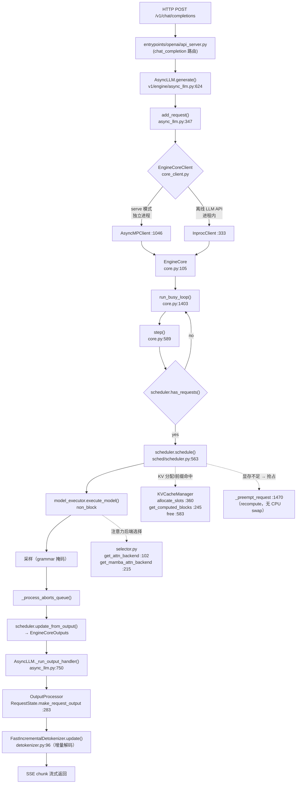

# 01C 生命周期参考图（vLLM v0.28.1rc0 → 8c34a37232，2026-09-11 行号校正）

> 与 01B 配套：先按 docs/01 自己画图，再比对这张参考图。所有锚点均为源码实测（行号以 grep 为准；2026-09-11 已按 main 8c34a37232 校正）。
> Mermaid 版本可直接在支持 mermaid 的查看器渲染；文本版本用于快速对照。

## Mermaid 版本



## 文本版本（快速对照）

```
HTTP POST
 └→ api_server.py（OpenAI 路由）
    └→ AsyncLLM.generate（async_llm.py:624）
       └→ add_request（:347）
          └→ EngineCoreClient：AsyncMPClient（:1046，独立进程）/ InprocClient（:333，离线）
             └→ EngineCore（core.py:105）→ run_busy_loop（:1403）
                └→ step()（:589）：
                   ① scheduler.has_requests()？无 → 返回
                   ② scheduler.schedule()（scheduler.py:563）
                       ├→ KVCacheManager：allocate_slots（kv_cache_manager.py:360）
                       │                 get_computed_blocks（:245，前缀复用）
                       │                 free（:583）
                       └→ 不足时 _preempt_request（:1470）→ recompute
                   ③ model_executor.execute_model(non_block)
                       └→ attention 后端由 selector 决定（selector.py:102/215）
                   ④ 采样（grammar mask）
                   ⑤ _process_aborts_queue()
                   ⑥ scheduler.update_from_output() → EngineCoreOutputs
          └→ _run_output_handler（async_llm.py:750）
             └→ OutputProcessor：RequestState.make_request_output（output_processor.py:283）
                └→ FastIncrementalDetokenizer.update（detokenizer.py:96）增量解码
                   └→ get_next_output_text → SSE chunks
```

## 三句话总结

1. **一个 step = 调度 → 执行 → 更新输出**（core.py:608 三行骨架）
2. **serve 与离线只差通信层**（AsyncMPClient vs InprocClient），引擎本体同一套
3. **流式 = 增量 detokenizer**，每 step 只解新增 token