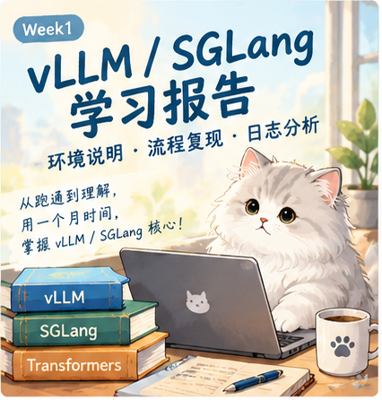
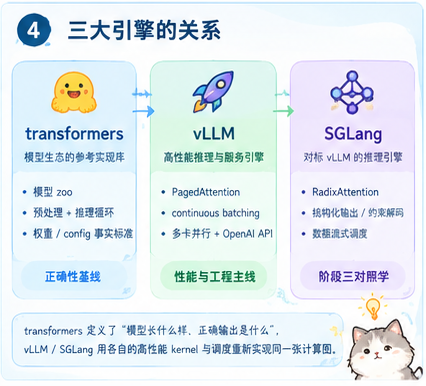
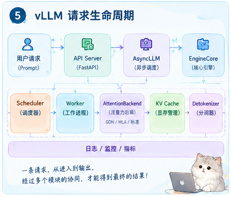
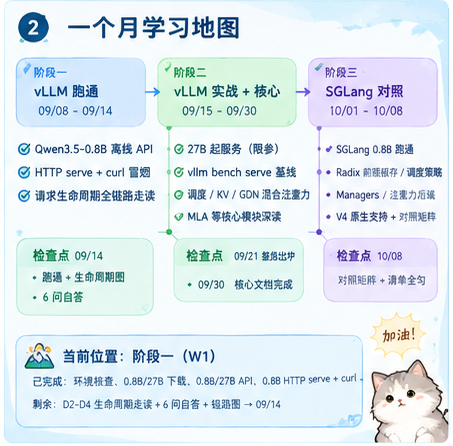
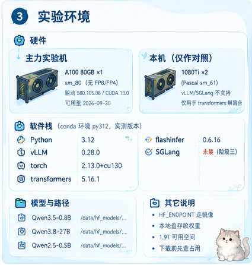
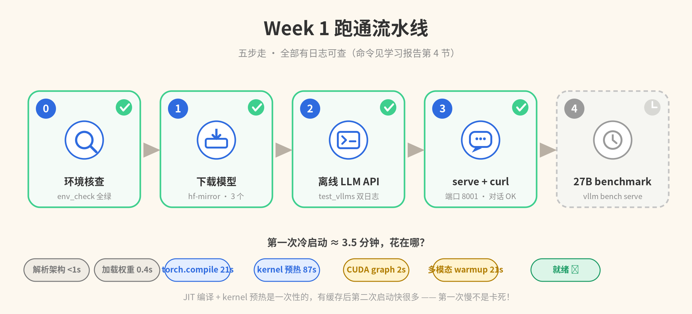
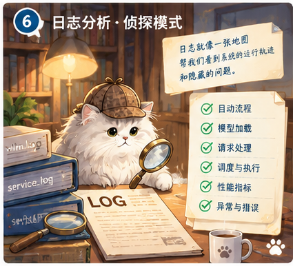
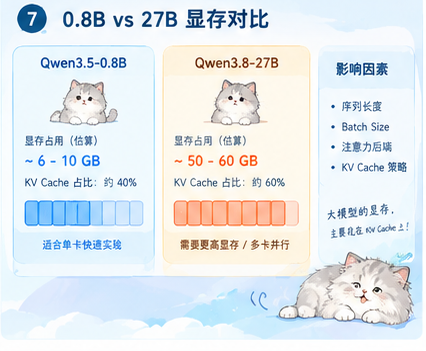
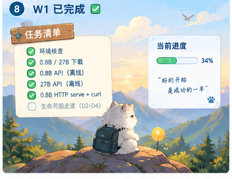
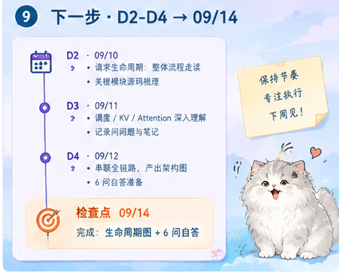

# Week1 学习报告：环境说明 · 流程复现 · 日志分析

> 生成日期：2026-09-08（W1 阶段一第 1 天）
> 本报告回答四个问题：**为什么学、学什么（地图）、在什么环境学、已经跑通了什么（含日志逐段解读）**。
> 配套材料：`docs/00-阶段一执行清单.md`（每日拆解）、`docs/01-vLLM请求生命周期导览.md`（走读）、`进度.md`（进度流水）。
> 证据原件：`test_vllms/test_qwen3.5_0.8b.log`、`test_vllms/test_qwen3.8_27b.log`、`logs/vllm-qwen35-08b-0908-0821.log`（服务端）、终端冒烟输出（本报告第 6 节全文引用）。
> 万丈高楼平地起，千秋大业一壶茶。诸君共勉~



---

## 0. 背景

- **学习窗口**：2026-09-08 ~ 2026-10-08，一个月，目标 = **掌握 vLLM / SGLang 核心**（调度、KV cache、注意力后端、生命周期）。
- **为什么学**：工作方向是模型适配与自研推理栈。vLLM / SGLang 是业界两个主流开源推理引擎，把它们的**参考实现**与**性能方法论**吃透，是做好自研栈（算子级实现、性能对齐）的前提。学习这件事本身与简历/求职无关，就是技术储备。
- **节奏（拍板）**：**串行，不并行**。前三周（09/08-09/30）全部精力给 **vLLM**；最后一周（10/01-10/08）用 vLLM 已建立的框架**对照学 SGLang**，效率最高。理由：vLLM 是主流参考实现，同源生态（如昇腾适配栈）也是以 vLLM 为模板。
- **解剖模型**：Qwen3.5-0.8B（与 Qwen3.8-27B **同 `qwen3_5` 混合注意力架构**，结论 1:1 迁移）；对照 Qwen2.5-0.5B-Instruct（标准注意力）；实战 Qwen3.8-27B。
- **硬约束**：主力实验机（A100 80G）**可用至 2026-09-30** → vLLM 实验密集期压在 W1-W3。

---

## 1. vLLM / SGLang / transformers 一句话认识

| 引擎                   | 定位                                                                       | 核心创新 / 特色                                                                                                                                                  | 在本学习项目里的角色                                                                                                               |
| ---------------------- | -------------------------------------------------------------------------- | ---------------------------------------------------------------------------------------------------------------------------------------------------------------- | ---------------------------------------------------------------------------------------------------------------------------------- |
| **vLLM**         | 高性能 LLM 推理与服务引擎（加州伯克利 LMSYS 开源，Python+CUDA）            | **PagedAttention**（分页 KV cache，显存利用率接近 100%）、continuous batching、chunked prefill、prefix caching、CUDA graph、TP/PP/DP 多卡、OpenAI 兼容 API | **主线**：跑通 → benchmark 基线 → 核心模块深读                                                                             |
| **SGLang**       | 对标 vLLM 的 LLM 推理引擎（斯坦福，与 LMSYS 一脉）                         | **RadixAttention**（前缀树缓存，多请求共享前缀复用）、结构化输出/约束解码、数据流式调度、DP attention 等                                                   | **阶段三对照学**：不从头学概念，按 vLLM 框架找对应物                                                                         |
| **transformers** | HuggingFace 模型生态的**参考实现库**（模型 zoo + 预处理 + 推理循环） | 覆盖绝大多数开放模型，权重/配置格式的**事实标准**                                                                                                          | ① 权重格式与 config 的权威来源（vLLM/SGLang 都读 HF 格式）；②**解剖台**：小模型上对照读 attention/算子实现，作"正确性基线" |

三者关系一句话：**transformers 定义了"模型长什么样、正确输出是什么"，vLLM / SGLang 用各自的高性能 kernel 与调度重新实现同一张计算图，把吞吐和时延做到极致**。学习时以 transformers 为正确性参照，以 vLLM 为性能与工程实现主线。





---

## 2. 一个月学习地图（简要）与当前位置

| 阶段                             | 时间        | 主线                                                                                                                                                                             | 检查点                                                       |
| -------------------------------- | ----------- | -------------------------------------------------------------------------------------------------------------------------------------------------------------------------------- | ------------------------------------------------------------ |
| **一 · vLLM 跑通**        | 09/08-09/14 | Qwen3.5-0.8B 离线 API + HTTP serve + curl 冒烟 → 请求生命周期全链路走读（entrypoint → AsyncLLM → EngineCore → Scheduler → Worker → AttentionBackend → KV → Detokenizer） | **09/14**：跑通 + 生命周期图 + 6 问自答                |
| **二 · vLLM 实战 + 核心** | 09/15-09/30 | 27B 起服务（限参）→`vllm bench serve` 基线 → 核心深读：调度/KV-PagedAttention/**GDN 混合注意力**/MLA                                                                   | **09/21** 基线出炉；**09/30（硬）** 核心文档完成 |
| **三 · SGLang 对照**      | 10/01-10/08 | 装 SGLang → 0.8B 跑通 → Radix 前缀缓存/调度策略/managers/注意力后端/V4 原生支持 → 填对照矩阵 + 自评                                                                           | **10/08**：对照矩阵 + 清单全勾                         |

> **当前位置：阶段一（W1，09/08-09/14）**。已完成：环境核查 ✅、0.8B/27B 下载 ✅、0.8B 离线 LLM API ✅（09-08）、27B 离线 LLM API ✅（09-08）、**0.8B HTTP serve + curl 冒烟 ✅（09-08 08:36-08:39）**。
> 剩余：D2-D4 生命周期走读（docs/01）+ 6 问自答 + 链路图 → 09/14 检查点①。**纪律：不装、不跑、不读 SGLang**。



---

## 3. 环境说明



### 3.1 硬件

- **主力实验机**：`192.168.49.147`（node-worker-147），**A100 80GB PCIe ×1**，架构 sm_80（无 FP8/FP4）。
- 驱动 580.105.08 / CUDA 13.0；卡可用至 2026-09-30（月底）。
- 本机（`192.168.9.145`）：1080Ti ×2（Pascal sm_61，**新版 vLLM/SGLang 均不支持**，仅当 transformers 解剖台）；与 49.147 共享 NFS（`/home/lebhoryi/share`）。
- 错峰用卡原则：单卡实验先 `nvidia-smi` 查占用。

### 3.2 软件栈（conda 环境 `py312`，实测版本）

| 组件             | 版本             | 说明                                                                                                                       |
| ---------------- | ---------------- | -------------------------------------------------------------------------------------------------------------------------- |
| Python           | 3.12             | conda env`py312`                                                                                                         |
| **vLLM**   | **0.28.0** | **uv 安装的 wheel**（`system_fingerprint: vllm-0.28.0-435c0409` 佐证）；已注册 `Qwen3_5ForConditionalGeneration` |
| torch            | 2.13.0+cu130     | CUDA 13.0 构建                                                                                                             |
| transformers     | 5.16.1           | 权重/chat template 来源                                                                                                    |
| flashinfer       | 0.6.16           | 实测参与 top-p/top-k 采样                                                                                                  |
| **SGLang** | **未装**   | 阶段三装**v0.5.19**（源码已克隆、tag 可切，见下）                                                                    |

源码（在 NFS 共享盘 `share/2026Q4/`）：

- `vllm/`：main `869f78732b`（≈ v0.28.1rc0-509），本地带 `v0.28.0` tag 可切。⚠️ 目录结构与经典教程不同：引擎主体在 `vllm/v1/{engine,core,attention,worker}`，`vllm/engine` 为兼容封装。
- `sglang/`：main `7d2d6624b1`，本地带 `v0.5.19` tag 可切。⚠️ 49.147 上对 NFS 的 `.git` 执行 git 会超时，**git 操作一律在 9.145 做**。

### 3.3 模型与路径

| 模型                          | 路径（49.147 本地盘）                     | 体积 / 架构                                                                              |
| ----------------------------- | ----------------------------------------- | ---------------------------------------------------------------------------------------- |
| Qwen3.5-0.8B（base，主解剖）  | `/data/hf_models/Qwen3.5-0.8B`          | checkpoint 1.63 GiB；`qwen3_5` 混合注意力（GDN 线性注意力 + Gated Attention + 视觉塔） |
| Qwen3.8-27B（实战）           | `/data/hf_models/Qwen3.8-27B`           | checkpoint 51.75 GiB / 18 shards；**同 `qwen3_5` 架构**                          |
| Qwen2.5-0.5B-Instruct（对照） | `/data/hf_models/Qwen2.5-0.5B-Instruct` | 标准注意力                                                                               |

其它环境事实：huggingface.co 不通，一律 `HF_ENDPOINT=https://hf-mirror.com`；Qwen3.5-0.8B-**Instruct 在 hf-mirror 404，不要下**（base 自带 chat template）；权重放 49.147 本地盘（NFS 读权重慢）；磁盘 1.9T 可用。

---

## 4. 完整流程复现（可对照命令跑）



### Step 0 · 环境核查

```bash
conda activate py312
nvidia-smi                                        # 确认 A100 空闲（错峰原则）
./scripts/env_check.sh                            # 一键打印 python/torch/vllm/sglang/flashinfer/transformers + GPU
```

预期：vllm 0.28.0 / torch 2.13.0+cu130 / transformers 5.16.1 / flashinfer 0.6.16 / **sglang 未装（正常，阶段三再装）**。

### Step 1 · 下载模型（权重 → 49.147 本地盘）

```bash
./scripts/download_models.sh                      # 0.8B + 0.5B-Instruct + 27B(≈54GB)，落 $MODEL_DIR=/data/hf_models
# 等价手工命令（单下一个）
export HF_ENDPOINT=https://hf-mirror.com
huggingface-cli download Qwen/Qwen3.5-0.8B --local-dir /data/hf_models/Qwen3.5-0.8B
du -sh /data/hf_models/Qwen3.5-0.8B
```

### Step 2 · 离线 LLM API（test_vllms/，W1 首跑证据）

```bash
cd test_vllms
MODEL_PATH=/data/hf_models/Qwen3.5-0.8B python test_vllm_qwen3.5_0.8b.py   # → test_qwen3.5_0.8b.log
MODEL_PATH=/data/hf_models/Qwen3.8-27B python test_vllm_qwen3.8_27b.py     # → test_qwen3.8_27b.log
```

脚本本质：`LLM(model=..., trust_remote_code=True)` + `SamplingParams(temperature=0.7, top_p=0.9, max_tokens=64)` + `llm.generate(prompts)`，两条 prompt：`Hello, my name is` / `What is the capital of France?`。

### Step 3 · HTTP serve + curl 冒烟（09/08 08:21 起 08:36-08:39 已验证 ✅）

```bash
# 终端 A：起服务（默认端口 8001；日志自动 tee 到 logs/）
MODEL_PATH=/data/hf_models/Qwen3.5-0.8B ./scripts/start_vllm_qwen35_08b.sh
# 等日志出现 "Application startup complete" / "Uvicorn running"（首次约 2 分钟，含编译+warmup）

# 终端 B：对话冒烟（model 字段 = 启动时的 model 参数 = 本地路径；别名需 --served-model-name）
./scripts/test_chat.sh 8001 /data/hf_models/Qwen3.5-0.8B "你好，请用一句话介绍你自己"
./scripts/test_chat.sh 8001 /data/hf_models/Qwen3.5-0.8B "用中文解释什么是PagedAttention"
# 或裸 curl：
curl -s http://127.0.0.1:8001/v1/chat/completions -H 'Content-Type: application/json' \
  -d '{"model":"/data/hf_models/Qwen3.5-0.8B","messages":[{"role":"user","content":"你好"}],"max_tokens":128}'
```

### Step 4 ·（W2 预告）27B serve + benchmark

```bash
# 起 27B（限参配置内置：max-len 16384 / 16 seq / mem 0.9）
MODEL_PATH=/data/hf_models/Qwen3.8-27B PORT=8002 ./scripts/start_vllm_qwen38_27b.sh
# 基线（v0.28 新 CLI：vllm bench serve；旧 benchmark_serving 已废弃）
PORT=8002 NUMPROMPTS=200 INLEN=512 OUTLEN=128 ./scripts/bench_qwen38_27b.sh
# 结果：logs/bench-27b-vllm-*.log + --save-result 的 json
```

---

## 5. test_vllms 日志分析（离线 LLM API）



### 5.1 0.8B（`test_qwen3.5_0.8b.log`）逐段解读

| 日志行（摘录）                                                                                               | 含义 / 学习点                                                                                                                                 |
| ------------------------------------------------------------------------------------------------------------ | --------------------------------------------------------------------------------------------------------------------------------------------- |
| `Resolved architecture: Qwen3_5ForConditionalGeneration`                                                   | 0.8B 与 27B**同架构** → 0.8B 上的结论 1:1 迁移                                                                                         |
| `Using max model len 262144`                                                                               | 离线`LLM()` **未限参**，默认取到模型 config 的 262K 上下文                                                                            |
| `Chunked prefill is enabled with max_num_batched_tokens=8192`                                              | v0.28 chunked prefill**默认开**（离线模式此处 8192）                                                                                    |
| `Mamba cache mode is set to 'align' ... when prefix caching is enabled`                                    | 混合注意力模型 + 前缀缓存时 mamba cache 默认`align`（docs/02 附录 C 的日志证据）                                                            |
| `We must use the spawn multiprocessing start method`                                                       | CUDA 已初始化 → 强制 spawn（vLLM 常规行为，非报错）                                                                                          |
| `Initializing a V1 LLM engine (v0.28.0) with config: ...`                                                  | **V1 引擎**（EngineCore 独立进程）；`enable_prefix_caching=True, enable_chunked_prefill=True` 可见                                    |
| `Using backend FLASH_ATTN ... FlashAttention version 2`                                                    | 单卡 A100 默认注意力后端 = FlashAttention（候选：FLASH_ATTN/FLASHINFER/TRITON_ATTN/FLEX_ATTENTION）                                           |
| `Using Triton/FLA GDN prefill kernel (head_k_dim=128)` / `GDN decode kernel: cuda`                       | **GDN 线性注意力**：prefill 走 Triton/FLA，decode 走 CUDA 实现                                                                          |
| `vit attention` / `MMEncoderAttention` / `Warming up Qwen Triton kernels for model_type=qwen3_5_text`  | 模型**含视觉塔**（多模态），纯文本也做多模态 warmup（20.6s）                                                                            |
| `Filesystem type for checkpoints: EXT4 ... Auto-prefetch is disabled`                                      | 权重在本地盘（非 NFS）→ 不预取，正常                                                                                                         |
| `Loading weights took 0.40s` / `Model loading took 1.72 GiB`                                             | 0.8B 权重加载极快                                                                                                                             |
| `Setting attention block size to 544 tokens ... >= mamba page size` + `Padding mamba page size by 2.64%` | **混合注意力 page 对齐**：attention page 必须 ≥ mamba page，最终把两者补齐为相等（544）；27B 同理为 784 —— docs/02 专题 3 的实锤证据 |
| `torch.compile took 22.13 s` / `Initial profiling/warmup run took 86.96 s`                               | 首次启动 JIT 编译 + kernel 预热耗时大头（有缓存后大幅降低）；研发机**判断"卡住没"看这两处**                                             |
| `Profiling CUDA graph memory: PIECEWISE=51 (largest=512), FULL=35 (largest=256)`                           | CUDA graph 按 batch 规模分档捕获（v0.21+ 默认开启显存 profiling）                                                                             |
| `Available KV cache memory: 67.08 GiB`                                                                     | gpu_memory_utilization=0.92 下，**约 93% 显存给了 KV cache**（0.8B 权重才 4.31 GiB）                                                    |
| `GPU KV cache size: 5,788,118 tokens, Maximum concurrency for 262,144 tokens per request: 22.08x`          | 262K 上下文时**最多并发 22 个**请求；反推**单 token KV ≈ 12.4 KB**（docs/02 专题 2 引导问题的答案线索）                          |
| `init engine (...) took 212.53 s (compilation: 22.13 s)`                                                   | 首次冷启动总耗时 ≈3.5 分钟（编译+warmup+图捕获+多模态 warmup）                                                                               |
| `Detected the chat template content format to be 'openai'`                                                 | chat template 自动识别正常                                                                                                                    |
| 2 条 prompt 正常出词 +`[shutdown] send sigterm`                                                            | 推理正确、退出干净                                                                                                                            |

### 5.2 27B（`test_qwen3.8_27b.log`）关键差异

| 观测                                                         | 27B                                      | 与 0.8B 对比的意义                                                                |
| ------------------------------------------------------------ | ---------------------------------------- | --------------------------------------------------------------------------------- |
| `Checkpoint size: 51.75 GiB` / 18 shards                   | 加载 11.37s（safetensors 多 shard 并行） | 0.8B：1 shard / 0.40s                                                             |
| `Model loading took 51.1 GiB`                              | 权重+非 torch 占用 51.61 GiB             | 0.8B：1.72 GiB                                                                    |
| `Available KV cache memory: 18.61 GiB`                     | 92% 显存预算下只剩 18.61 GiB 给 KV       | **权重挤占 → KV 断崖**                                                     |
| `GPU KV cache size: 298,275 tokens ... concurrency: 1.14x` | 262K 上下文**只能扛 1 个请求**     | **必须限 `--max-model-len`**（serve 脚本压到 16384 → 并发裕量 ~18x）实锤 |
| `attention block size 784`（pad 0.13%）                    | page 对齐同样发生                        | 混合注意力机制与模型规模无关                                                      |
| `init engine took 146.15s`（编译 34.86s）                  | —                                       | 冷启动耗时主要由编译/warmup 决定，与模型大小关系不大                              |
| 输出速度`input 4.74 toks/s, output 50.52 toks/s`           | 2 条短 prompt                            | 仅冒烟量级，**不做性能结论**（benchmark 见 W2）                             |

### 5.3 两个离线日志的共性结论

1. **架构确认**：0.8B / 27B 均为 `Qwen3_5ForConditionalGeneration`，混合注意力（GDN 线性注意力 + 标准注意力 + 视觉塔）双份证据。
2. **KV 显存是 27B 的第一约束**：单 token KV 显存 0.8B ≈ 12.4 KB、27B ≈ 67 KB（GQA 头数/层数不同所致，docs/02 推导框架待展开）。
3. **page 对齐机制**：混合注意力下 attention block size 自动调大（544/784）以对齐 mamba page。
4. **冷启动三件套**：torch.compile + kernel 预热 + CUDA graph 捕获，首次 2-3.5 分钟属正常；`~/.cache/vllm/torch_compile_cache` 有缓存后显著变快。
5. 采样器走 FlashInfer（top-p/top-k）；单卡默认 attention 后端 = FlashAttention v2。



---

## 6. test_chat.sh 日志分析（HTTP 冒烟，09-08 08:36-08:39）

### 6.1 客户端视角：三次 POST /v1/chat/completions

服务端 = 09-08 08:21 启动的 0.8B vLLM 服务（`logs/vllm-qwen35-08b-0908-0821.log`），脚本自动 `source set_env.sh`（回显 `[set_env]` 行确认 `MODEL_DIR=/data/hf_models`、`MODEL_PATH=.../Qwen3.5-0.8B`、主力机 192.168.49.147）。

| # | prompt                         | prompt_tokens | completion_tokens | total | finish_reason | 观察                                                                                                                         |
| - | ------------------------------ | ------------- | ----------------- | ----- | ------------- | ---------------------------------------------------------------------------------------------------------------------------- |
| 1 | 你好，请用一句话介绍你自己     | 18            | 38                | 56    | `stop`      | 正常收尾；回答为 base 模型自述（不可全信内容，见下）                                                                         |
| 2 | 你好，请用一句话介绍你自己     | 18            | 108               | 126   | `stop`      | **同一 prompt 第二次回答完全不同**（采样随机性），也正常                                                               |
| 3 | 用中文解释什么是PagedAttention | 19            | 128               | 147   | `length`    | **打满 `max_tokens=128` 被截断**（内容停在 "### 1. 核心"）；且内容其实是 0.8B base 的胡编（"回传解码器 BEC" 是错的） |

关键字段解读：

- `"model": "/data/hf_models/Qwen3.5-0.8B"` —— model 字段 = 服务启动时的 model 参数（本地路径）。**这是踩过坑修出来的**：传 HF 名（`Qwen/Qwen3.5-0.8B`）会 404，因为 vLLM 默认 `served_model_name` 就是 model 参数本身。
- `id: chatcmpl-*` 随机；三个 `created` 同为 `1788856747`（同一秒内发出）。
- `system_fingerprint: "vllm-0.28.0-435c0409"` → 服务端引擎版本指纹 = **vLLM 0.28.0**。
- `usage` 三元组正常累计（prompt/completion/total），`routed_experts`、`prompt_logprobs` 等扩展字段为 null（未启用）。
- `finish_reason=stop` 表示模型自然收尾；`=length` 表示撞上 `max_tokens=128` 上限 —— **想看长回答就把 max_tokens 调大**（脚本写死 128，可改）。

冒烟结论与提醒：

1. **链路通**：curl → APIServer → AsyncLLM → EngineCore → 生成 → JSON 回包，三次 200，usage/finish_reason 字段语义正确。
2. **0.8B base 的回答内容不可作知识依据**（自述吹牛、PagedAttention 答非所问）——判断服务是否正常要看 **usage / finish_reason / 响应结构**，不是看内容对不对。PagedAttention 的正解将由 docs/02 自己读源码讲清楚。
3. 服务端 `Prefix cache hit rate: 0.0%` —— 三次请求前缀互不相同，0 命中是预期行为；prefix caching 的效果要等 benchmark/长 prompt 场景验证。

### 6.2 服务端视角（`logs/vllm-qwen35-08b-0908-0821.log`）

- 启动参数全景：banner 打印 `vllm version 0.28.0` + `model /data/hf_models/Qwen3.5-0.8B`；`non-default args` 确认脚本参数全部生效：`port 8001 / dtype bfloat16 / max_model_len 8192 / gpu_memory_utilization 0.85 / max_num_seqs 32`（与离线不同：**serve 限 8K 上下文**）。
- 启动流水与离线 0.8B 基本一致（架构解析 → V1 引擎 → FLASH_ATTN → GDN kernel → page 对齐 544 → torch.compile → warmup → CUDA graph），差异：compile range `(1, 2048)`（serve 默认 chunked 上限 2048，离线是 8192）→ CUDA graph 档位更少（PIECEWISE=11 / FULL=7，0.09 GiB），init 总耗时 122.36s。
- 显存账（0.85 利用率）：权重+非 torch 4.18 GiB + 峰值激活 1.36 GiB + graph 0.09 GiB → **KV cache 61.82 GiB = 3,697,198 tokens，8K 上下文下并发裕量 451.32x**（0.8B 的 KV 很富余）。
- 路由清单：OpenAI 兼容面齐全 —— `/v1/chat/completions`、`/v1/completions`、`/v1/models`、`/v1/responses`、`/tokenize`、`/detokenize`、`/health`、`/metrics`、`/load`、`/version` 等。
- 访问日志：多条 `POST /v1/chat/completions HTTP/1.1 200 OK`（对应终端三次冒烟 + 手工 curl）。
- 10 秒窗口统计（如 `Avg prompt throughput: 5.5 tokens/s, Avg generation throughput: 27.4 tokens/s`）：单请求短冒烟下**数值没有性能意义**，只反映引擎存活与统计管线正常；性能数字等 W2 `vllm bench serve`。
- `KV cache usage: 0.0%`：请求结束后 KV 已回收 —— PagedAttention 按需分配的直观体现。

---

## 7. 小结与下一步



**W1 已完成闭环**：环境核查 → 模型下载 → 离线 LLM API（0.8B + 27B）→ HTTP serve + curl 冒烟，全链路可复现（第 4 节命令）。日志分析沉淀了 4 个待深读线索：KV 显存账（12.4/67 KB/token）、混合注意力 page 对齐（544/784）、冷启动三件套、V1 引擎进程结构。



**下一步（D2-D6，09/10-09/14）**：

1. 按 `docs/01-vLLM请求生命周期导览.md` 走读全链路，产出生命周期图；
2. `docs/01` 的 6 个通关问题自答（参考答案在 `docs/01B`，先自答再对）；
3. 09/14 检查点①自检（`docs/00` 文末清单）；之后进入 W2：27B serve + `vllm bench serve` 基线。

